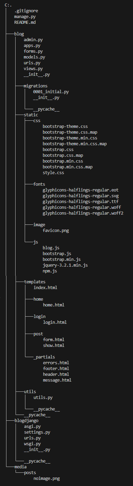

# blogdjango

Prototype of a Blog developed using _Django_ and _SQLite_ database.

---

## 🚀 Features

- Uses _Bootstrap_ for responsive and elegant templates.
- Each post is linked to a previously registered user.
- Only the author of a post can edit or delete it.
- Includes user authentication: _Login_ and password protection.
- Certain actions are restricted to authenticated users.
- Comes with a built-in administrative interface (_Superuser_) for managing content and users.

---

## 🛠️ Software Stack

- **Python** 3.13.7  
- **Django** 5.2.7  
- **SQLite** 3  
- **Bootstrap** 3.3.7  

---

## 📁 Project Structure

---